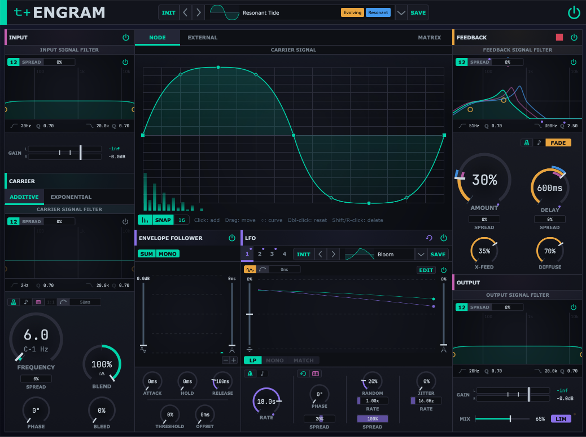

# ENGRAM FM

### A unified quadrature modulation engine

VST3 for macOS and Windows, by [track+trace](https://github.com/trackplustrace).
This is a public beta: it is stable enough to make music with, it is not finished, and it is
not code-signed.

**[Read the manual](https://trackplustrace.github.io/Engram/engram_manual.html)** to see what every control does before installing.

> **Before you install on macOS, read [Installing on macOS](#installing-on-macos).** macOS
> will tell you Engram may contain malware and offer to delete it, and the button that
> deletes it is the default option. There is a way through, but macOS will not show it to you.

## What it is

Engram takes incoming audio and multiplies it against an internal carrier oscillator using a
quadrature (90°-phase) architecture, the same technique used to generate and demodulate
single-sideband radio. Depending on how you set it, the same signal path produces clean
frequency shifting, classic ring modulation, and amplitude modulation, blending continuously
between those. A separate phase-modulation algorithm swaps the frequency shift for FM-style
timbres.

**Frequency shifting is not pitch shifting.** Pitch shifting multiplies every partial by the
same ratio, so harmonic relationships survive. Frequency shifting adds a fixed Hz offset to
every partial, which breaks them. Shift a 440 Hz tone up by 100 Hz and the fundamental
becomes 540 Hz, but its 880 Hz overtone becomes 980 Hz rather than 1080 Hz. The harmonic
series is pulled apart into an inharmonic, bell-like or metallic spectrum, and it grows more
extreme as the shift increases.

Typical territory is subtle stereo detuning at low rates, ring modulation and inharmonic
metallics at audio rates, evolving drones built out of feedback resonance, and full spectral
mangling once feedback, diffusion, and modulation are pushed. A live input drives all of it,
so the results stay tightly coupled to the source material.

It is not a subtle effect and it is not a "fix-it" tool. Engram is an experimental,
inspiration-first sound-design instrument, meant to be played and explored rather than
dialled in to spec. It rewards exploration and rarely sounds exactly the same twice.

## What you need

macOS 11 Big Sur (or later) or Windows 10 64-bit (or later), and host that loads VST3 plugins.

## Installing on macOS

*read this before you download*

macOS will refuse to open the installer and tell you Apple cannot verify it is free of
malware. It says this about all unsigned software. Engram is unsigned because notarisation
requires a paid Apple Developer Program membership. The warning is about a missing certificate, 
not about anything found in the software.

Getting past it takes half a minute:

1. Double-click `Engram.pkg`. macOS says *"Engram.pkg" Not Opened* and offers **Done** and
   **Move to Bin**. Press **Done**.
2. Open **System Settings**, go to **Privacy & Security**, and scroll down to **Security**.
   There is a line reading *"Engram.pkg" was blocked to protect your Mac* with an **Open
   Anyway** button beside it. Press that.
3. A second warning appears, telling you not to open this unless you are certain it is from a
   trustworthy source. Press **Open Anyway** again — it sits underneath Move to Bin.
4. Authenticate with Touch ID or your password.
5. The installer opens. Continue through it as normal.

Engram installs to `~/Library/Audio/Plug-Ins/VST3` in your own home folder, which every DAW
scans, so it will be found on the next plugin rescan. It installs for your user account only
and never asks for an administrator password.

The factory preset library installs to `~/Library/track+trace/Engram/presets` and is available
the first time you open Engram.

The warning applies to the installer, not the plug-in itself. So your DAW will load it without
complaint.

## Installing on Windows

The zip contains `Engram.vst3` and a folder named `Engram Presets`.

Copy `Engram.vst3` into `C:\Program Files\Common Files\VST3`.

`Engram Presets` is the factory preset library. Engram reads it where it sits, so move it
somewhere permanent, the default folder is 
`C:\Users\<you>\AppData\Roaming\track+trace\Engram\presets`. 

If you install the presets to a custom location, open the preset menu, and at the bottom 
next to `Location:` click `CHANGE`, then select your `Engram Presets` folder. The presets 
load on the next scan.

## Reporting issues

Open an [issue](../../issues). That is what this repository is for.

Include the version number from the footer at the bottom of the plugin window. It matches the
release you downloaded, so it tells us exactly which build you are on. Beyond that: your OS
and DAW with versions, what you did, what you expected, and what happened instead. Say whether
it happens every time or only sometimes, and mention the source material if the problem only
shows up on certain audio.

Crashes, failures, confusing functionality, unexpected behaviour, feature requests, everything
is worth reporting.

Two things are known and expected rather than bugs. Engram is phase-dependent and never truly
static, because frequency shifting continuously rotates the phase relationship between the
channels and around the feedback loop. And a preset captures Engram's settings but not its
sound, since the effect is driven by your live input: the same preset on different material,
at a different carrier rate, or with different feedback amount or delay time can sound 
completely different. Presets are starting points, not final results.

## Levels

Engram's output is soft-clipped, a feedback patch that runs away cannot run away to
infinity. So the instrument is safe to explore.

It can still arrive at full scale suddenly, especially with resonant filters applied. Watch 
your levels while you are pushing feedback, use the Flush button to reset the feedback buffer.

## Source and terms

Engram is not open source. This repository carries the builds, the release notes, and the
issue tracker. The source lives elsewhere and is private. All rights reserved.

It is also a free beta, provided as is and without warranty of any kind. It will have bugs,
and you use it at your own risk.

---

Built with <a href="https://juce.com">JUCE</a>. Hilbert transform via
<a href="http://ldesoras.free.fr/prod.html">HIIR</a> by Laurent de Soras (WTFPL).
